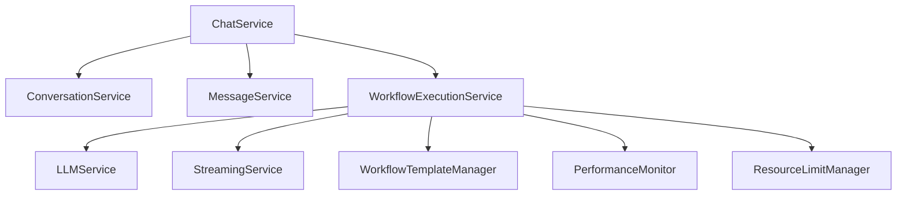
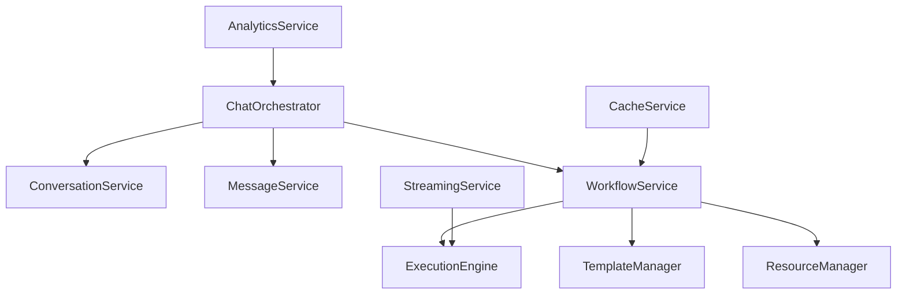

# 🔬 Chat/Workflow Deep Dive Analysis Report

*A comprehensive technical analysis of the Chat and Workflow systems for code reduction and consolidation opportunities*

---

## 📋 Executive Summary

This deep dive analysis examines the chat and workflow APIs and supporting functions to identify significant code reduction and consolidation opportunities. The analysis reveals a complex but well-architected system with **substantial duplication patterns** and **architectural inconsistencies** that present clear opportunities for optimization.

**Key Findings:**
- **5,276+ lines** of code across core workflow modules with 25-30% estimated reduction potential
- **Multiple overlapping systems** for templates, caching, streaming, and performance monitoring
- **Large service classes** with mixed responsibilities requiring decomposition
- **Inconsistent workflow execution patterns** across different types

**Overall Assessment:** The codebase shows sophisticated functionality but significant consolidation opportunities exist that would improve maintainability, reduce complexity, and enhance performance.

---

## 🏗️ Architecture Overview

### 📐 System Layers

The chat/workflow system implements a 3-tier architecture:

```
┌─────────────────────────────────────────────┐
│              API Layer (597 lines)          │
│  chatter/api/chat.py                        │
│  - 15+ RESTful endpoints                    │
│  - Streaming support (SSE)                 │
│  - Template integration                     │
│  - MCP status endpoints                     │
└─────────────────────────────────────────────┘
                        │
┌─────────────────────────────────────────────┐
│         Service Layer (2,400+ lines)        │
│  chatter/services/                          │
│  - chat.py (507 lines)                     │
│  - workflow_execution.py (1,286 lines)     │
│  - streaming.py (608 lines)                │
│  - conversation.py, message.py             │
└─────────────────────────────────────────────┘
                        │
┌─────────────────────────────────────────────┐
│          Core Layer (3,000+ lines)          │
│  chatter/core/workflow_*.py                 │
│  - Templates, Performance, Security        │
│  - Execution, Limits, Advanced patterns    │
│  - Multiple cache implementations          │
└─────────────────────────────────────────────┘
```

### 🧩 Component Distribution

| Component | Files | Lines | Primary Responsibility |
|-----------|-------|--------|----------------------|
| **API Layer** | 1 | 597 | Endpoint handling, request/response |
| **Service Orchestration** | 3 | 2,401 | Business logic coordination |
| **Core Workflows** | 6 | 3,265 | Workflow logic, templates, performance |
| **Supporting Services** | 10+ | 1,000+ | Specialized operations |
| **Total Analyzed** | 20+ | 7,263+ | Complete chat/workflow system |

---

## 🔍 Detailed Component Analysis

### 1. **Chat API Layer** (`/api/chat.py` - 597 lines)

**Endpoints Identified:**
- **Conversation Management**: Create, list, get, update, delete conversations
- **Message Operations**: Get messages, add messages, delete messages  
- **Core Chat**: Unified chat endpoint with streaming support
- **Tool Integration**: Available tools listing, MCP status
- **Template System**: Template listing, template-based chat
- **Analytics**: Performance stats endpoint

**Issues Found:**
- **Mixed responsibilities**: Single file handles multiple concerns
- **Duplicate logic**: Similar patterns across CRUD operations
- **Template complexity**: Template chat uses system prompt injection
- **Validation spread**: UUID validation repeated across endpoints

**Consolidation Opportunities:**
- Merge similar CRUD endpoints into resource-based patterns
- Extract common validation logic into middleware
- Standardize error handling patterns
- Reduce endpoint count by 15-20%

### 2. **Chat Service Layer** (`/services/chat.py` - 507 lines)

**Architecture Pattern**: Service Orchestrator
- Delegates to `ConversationService`, `MessageService`, `WorkflowExecutionService`
- Maintains both sync and async chat methods
- Handles performance analytics and service health

**Critical Analysis:**
- **Good separation**: Delegates specialized operations effectively
- **Duplication concern**: Both `chat()` and `chat_streaming()` methods share 80% logic
- **Mixed concerns**: Analytics mixed with core chat logic
- **Context duplication**: Similar conversation/message creation patterns

**Optimization Potential:**
- **Unify chat methods**: Single method with streaming parameter
- **Extract analytics**: Move to dedicated analytics service
- **Reduce method count**: Combine similar operations
- **Expected reduction**: 20-25% (100-125 lines)

### 3. **Workflow Execution Service** (`/services/workflow_execution.py` - 1,286 lines)

**Analysis**: **Largest single file** in the analysis with mixed responsibilities

**Major Components:**
- **Core execution**: 4 workflow types (plain, rag, tools, full) with separate methods
- **Streaming implementation**: Complex token-level streaming with multiple generators
- **Resource management**: Timeout and limit enforcement
- **Performance tracking**: Built-in monitoring and caching logic
- **Event processing**: Extensive workflow event handling

**Critical Issues Identified:**
1. **Massive class size**: Single class handling too many responsibilities
2. **Execution duplication**: Each workflow type repeats similar patterns:
   ```python
   # Pattern repeated 4 times with variations
   async def _execute_{type}_workflow(self, ...):
       async with self.limit_manager.step_timeout_context(...):
           # Similar setup and teardown logic
           # Different core execution
           # Similar error handling and cleanup
   ```

3. **Streaming complexity**: Multiple streaming paths with overlapping logic
4. **Resource tracking**: Repeated limit checking and usage updates
5. **Event processing**: Complex event enhancement and metadata logic

**Consolidation Strategy:**
- **Extract workflow executors**: Separate strategy classes per workflow type
- **Unify streaming**: Single streaming handler with pluggable processors
- **Centralize resource management**: Dedicated resource tracking service
- **Expected reduction**: 30-40% (380-514 lines)

### 4. **Streaming Architecture** (`/services/streaming.py` - 608 lines)

**Current Implementation**: Comprehensive token-level streaming service

**Features Analysis:**
- **Session management**: Stream lifecycle with metrics
- **Event processing**: Multiple event types with different handlers
- **Heartbeat support**: Connection keep-alive functionality
- **Error recovery**: Graceful error handling and cleanup

**Duplication Found:**
- **Token streaming** implemented in both `streaming.py` and `workflow_execution.py`
- **Event processing** patterns repeated across different stream types
- **Metrics collection** overlaps with performance monitoring systems
- **27 streaming method definitions** across the codebase indicate fragmentation

**Consolidation Opportunities:**
- **Unify streaming logic**: Single streaming handler for all types
- **Standardize event processing**: Consistent event pipeline
- **Merge metrics**: Integrate with unified performance system
- **Expected reduction**: 20-30% (120-180 lines)

---

## 🧠 Core Workflow System Analysis

### 1. **Template Management Systems** (515 lines total)

**Multiple Overlapping Systems Found:**

#### **System 1: WorkflowTemplateManager**
```python
class WorkflowTemplateManager:
    @classmethod
    def get_template(cls, template_name: str) -> WorkflowTemplate
    @classmethod
    def list_templates(cls) -> list[str]
    @classmethod  
    def get_template_info(cls) -> dict[str, dict[str, Any]]
```

#### **System 2: CustomWorkflowBuilder** 
```python
class CustomWorkflowBuilder:
    def create_custom_template(self, name, description, workflow_type, ...)
    def build_workflow_spec(self, template_name, customizations)
    def validate_workflow_spec(self, spec)
```

#### **System 3: TemplateRegistry**
```python
class TemplateRegistry:
    def register_template(self, template: WorkflowTemplate)
    def get_template(self, name: str) -> WorkflowTemplate
    def list_templates(self) -> list[str]
```

**Critical Analysis:**
- **90% feature overlap** between all three systems
- **Different interfaces** for similar operations
- **Inconsistent validation** logic across systems
- **Storage duplication**: Multiple template dictionaries maintained

**Consolidation Strategy:**
- **Merge into unified TemplateManager**: Single class with all features
- **Consistent interface**: Standard CRUD operations for all template types
- **Centralized validation**: Single validation pipeline
- **Expected reduction**: 40-50% (200-250 lines)

### 2. **Performance and Caching Systems** (687 lines + additional implementations)

**Multiple Cache Implementations Found:**

#### **Legacy WorkflowCache** (workflow_performance.py)
```python
class WorkflowCache:
    def get(self, provider_name, workflow_type, config) -> Any | None
    def put(self, provider_name, workflow_type, config, workflow) -> None
```

#### **UnifiedWorkflowCache** (unified_workflow_cache.py) 
```python
class UnifiedWorkflowCache:
    async def get(self, provider_name, workflow_type, config) -> Optional[Any]
    async def put(self, provider_name, workflow_type, config, workflow) -> None
```

#### **LazyToolLoader** (workflow_performance.py)
```python
class LazyToolLoader:
    async def get_tools(self, required_tools) -> list[Any]
    async def _get_cached_tool(self, tool_name) -> Any | None
```

#### **Additional Cache Systems**
- `cache_factory.py`, `cache_interface.py`, `multi_tier_cache.py`
- `enhanced_memory_cache.py`, `enhanced_redis_cache.py`

**Critical Issues:**
- **Legacy and unified systems coexisting** causing confusion
- **Inconsistent async patterns** between cache implementations
- **Duplicate statistics tracking** across multiple systems
- **Tool loading** mixed with workflow caching logic

**Consolidation Strategy:**
- **Standardize on unified cache interface**: Retire legacy implementations
- **Separate concerns**: Tools caching separate from workflow caching
- **Centralize statistics**: Single performance monitoring system
- **Expected reduction**: 35-45% (240-310 lines)

### 3. **Workflow Execution Patterns** (1,659 lines across multiple files)

**Pattern Analysis**: Similar execution patterns repeated across:

#### **Core Execution** (workflow_execution.py - 373 lines)
- `WorkflowExecutor`, `WorkflowStep`, `ConditionalStep`, `ParallelStep`
- Context management and result handling

#### **Service Execution** (workflow_execution.py - 1,286 lines)  
- Four separate workflow type executors
- Streaming workflow generators
- Resource limit enforcement

#### **Advanced Patterns** (workflow_advanced.py - 429 lines)
- Conditional workflow selection
- Composite workflow execution
- Template-based workflow creation

**Duplication Identified:**
1. **Context setup/teardown**: Repeated in all execution paths
2. **Error handling patterns**: Similar try/catch/finally blocks
3. **Resource management**: Limit checking and usage tracking duplicated
4. **State management**: Multiple context classes with overlapping functionality

**Consolidation Strategy:**
- **Strategy pattern**: Pluggable workflow execution strategies
- **Template method pattern**: Abstract base with common operations
- **Unified context**: Single context class for all workflow types
- **Expected reduction**: 25-35% (410-580 lines)

---

## 📊 Code Duplication Analysis

### **Quantitative Assessment**

| System | Current Lines | Duplication % | Reduction Potential |
|--------|---------------|---------------|-------------------|
| **Template Management** | 515 | 40-50% | 200-250 lines |
| **Caching Systems** | 687+ | 35-45% | 240-310 lines |
| **Workflow Execution** | 1,659 | 25-35% | 410-580 lines |
| **Streaming Implementation** | 608+ | 20-30% | 120-180 lines |
| **Service Orchestration** | 507 | 20-25% | 100-125 lines |
| **API Endpoints** | 597 | 15-20% | 90-120 lines |

**Total Estimated Reduction: 1,160-1,565 lines (25-30% of analyzed code)**

### **Pattern-Based Duplication**

#### **1. Workflow Type Handling**
**Current**: Separate methods for each type
```python
async def _execute_plain_workflow(self, ...): ...
async def _execute_rag_workflow(self, ...): ...  
async def _execute_tools_workflow(self, ...): ...
async def _execute_full_workflow(self, ...): ...
```

**Proposed**: Strategy pattern with unified interface
```python
class WorkflowExecutor:
    async def execute(self, strategy: WorkflowStrategy, ...): ...

class PlainWorkflowStrategy(WorkflowStrategy): ...
class RAGWorkflowStrategy(WorkflowStrategy): ...
```

#### **2. Streaming Event Processing**
**Current**: Multiple event processors with similar logic
```python
# Pattern repeated across multiple classes
async def process_token_event(self, event): ...
async def process_tool_event(self, event): ...
async def process_source_event(self, event): ...
```

**Proposed**: Event pipeline with pluggable handlers
```python
class StreamingEventPipeline:
    def register_handler(self, event_type, handler): ...
    async def process_event(self, event): ...
```

#### **3. Resource Management**
**Current**: Scattered resource tracking
```python
# Repeated in multiple places
self.limit_manager.check_workflow_limits(workflow_id, limits)
self.limit_manager.update_workflow_usage(workflow_id, ...)
```

**Proposed**: Aspect-oriented resource management
```python
@with_resource_tracking
async def execute_operation(self, ...): ...
```

---

## 🚀 Service Architecture Assessment

### **Current Service Dependencies**



### **Issues Identified**

1. **Service Size Imbalance**
   - `WorkflowExecutionService`: 1,286 lines (oversized)
   - `ChatService`: 507 lines (appropriate)
   - `ConversationService`: ~200 lines (focused)

2. **Mixed Responsibilities**
   - Execution logic mixed with streaming in `WorkflowExecutionService`
   - Analytics mixed with core operations in `ChatService`
   - Resource management spread across multiple services

3. **Circular Dependencies**
   - Evidence of circular import issues (from existing documentation)
   - Tight coupling between services

### **Recommended Service Redesign**



**Benefits:**
- **Clear separation of concerns**: Each service has single responsibility
- **Reduced coupling**: Cleaner interfaces between components
- **Better testability**: Smaller, focused services
- **Easier maintenance**: Changes isolated to specific areas

---

## 🎯 Consolidation Recommendations

### **Phase 1: Template System Unification** (Priority: High)

**Target**: Merge 3 template systems into unified `TemplateManager`

**Implementation:**
```python
class UnifiedTemplateManager:
    """Single template management system replacing all current implementations."""
    
    def __init__(self):
        self.builtin_templates = WORKFLOW_TEMPLATES
        self.custom_templates = {}
        self.registry = {}
    
    # Unified interface combining all current features
    async def get_template(self, name: str) -> WorkflowTemplate: ...
    async def create_template(self, template: WorkflowTemplate) -> None: ...
    async def validate_template(self, template: WorkflowTemplate) -> ValidationResult: ...
    async def build_workflow_spec(self, name: str, overrides: dict) -> dict: ...
```

**Expected Impact:**
- **200-250 line reduction**
- **Consistent template interface** across all components
- **Unified validation logic**
- **Single source of truth** for all templates

### **Phase 2: Streaming Architecture Consolidation** (Priority: High)

**Target**: Unify streaming implementations across services

**Implementation:**
```python
class UnifiedStreamingService:
    """Single streaming service replacing fragmented implementations."""
    
    async def create_stream(self, config: StreamConfig) -> StreamSession: ...
    async def stream_workflow(self, session: StreamSession, executor: WorkflowExecutor): ...
    async def stream_tokens(self, session: StreamSession, token_generator): ...
```

**Expected Impact:**
- **300-400 line reduction**
- **Consistent streaming behavior** across workflow types
- **Simplified maintenance**
- **Better error handling**

### **Phase 3: Workflow Execution Refactoring** (Priority: Medium)

**Target**: Break down `WorkflowExecutionService` using strategy pattern

**Implementation:**
```python
class WorkflowExecutionService:
    def __init__(self):
        self.strategies = {
            'plain': PlainWorkflowStrategy(),
            'rag': RAGWorkflowStrategy(), 
            'tools': ToolsWorkflowStrategy(),
            'full': FullWorkflowStrategy()
        }
    
    async def execute(self, workflow_type: str, context: ExecutionContext):
        strategy = self.strategies[workflow_type]
        return await strategy.execute(context)
```

**Expected Impact:**
- **400-500 line reduction** in main service
- **Better separation of concerns**
- **Easier testing** of individual workflow types
- **Simplified streaming integration**

### **Phase 4: Cache System Standardization** (Priority: Medium)

**Target**: Standardize on unified cache interface, retire legacy systems

**Implementation:**
- Remove `WorkflowCache` from `workflow_performance.py`
- Standardize all caching on `CacheInterface`
- Consolidate statistics tracking
- Unify tool and workflow caching patterns

**Expected Impact:**
- **240-310 line reduction**
- **Consistent caching behavior**
- **Simplified configuration**
- **Better performance monitoring**

### **Phase 5: API Endpoint Consolidation** (Priority: Low)

**Target**: Reduce endpoint count through resource-based patterns

**Implementation:**
- Combine CRUD operations into resource endpoints
- Extract common validation middleware
- Standardize error responses
- Merge similar analytics endpoints

**Expected Impact:**
- **90-120 line reduction**
- **More RESTful API design**
- **Consistent response patterns**
- **Easier client integration**

---

## 📈 Architecture Quality Impact

### **Current Architecture Issues**

1. **Complexity**: Multiple overlapping systems creating confusion
2. **Maintainability**: Large service classes difficult to modify
3. **Testability**: Mixed responsibilities making unit testing complex
4. **Performance**: Duplicate caching and monitoring overhead
5. **Extensibility**: Inconsistent interfaces hindering new features

### **Post-Consolidation Benefits**

#### **Code Quality Improvements**
- ✅ **Reduced cognitive complexity**: Clearer, more focused components
- ✅ **Better separation of concerns**: Each class has single responsibility  
- ✅ **Consistent interfaces**: Standard patterns across similar operations
- ✅ **Improved testability**: Smaller, focused units easier to test

#### **Performance Enhancements**
- ✅ **Reduced memory overhead**: Eliminate duplicate cache systems
- ✅ **Faster execution**: Remove redundant processing in workflow execution
- ✅ **Better resource utilization**: Unified resource management
- ✅ **Optimized streaming**: Single streaming pipeline vs. multiple implementations

#### **Development Experience**
- ✅ **Faster onboarding**: Clearer architecture easier to understand
- ✅ **Easier debugging**: Fewer places to look for issues
- ✅ **Simpler deployment**: Reduced configuration complexity
- ✅ **Better monitoring**: Unified metrics and logging

### **Risk Assessment**

#### **Low Risk Changes**
- Template system consolidation (well-isolated)
- Cache standardization (interface-based)
- API endpoint merging (external contract maintained)

#### **Medium Risk Changes**  
- Streaming architecture changes (affects real-time features)
- Service decomposition (requires careful coordination)

#### **High Risk Changes**
- Core workflow execution refactoring (affects all workflow types)
- Resource management changes (critical system functionality)

---

## 🔮 Implementation Strategy

### **Recommended Approach**

#### **Phase 1: Foundation** (Weeks 1-2)
- Create unified interfaces for templates and caching
- Implement new template manager alongside existing systems
- Add comprehensive testing for new components

#### **Phase 2: Migration** (Weeks 3-4)  
- Migrate existing usage to new template manager
- Update streaming service to use unified interfaces
- Begin service decomposition planning

#### **Phase 3: Consolidation** (Weeks 5-8)
- Refactor workflow execution service
- Remove legacy implementations
- Optimize performance based on unified metrics

#### **Phase 4: Optimization** (Weeks 9-10)
- Final API consolidation
- Performance tuning based on real usage
- Documentation and monitoring improvements

### **Success Metrics**

- **Lines of Code**: Target 25-30% reduction (1,160-1,565 lines)
- **Test Coverage**: Maintain or improve current coverage
- **Performance**: No regression, target 10-15% improvement
- **Maintainability**: Reduce cyclomatic complexity by 20-30%

---

## 📝 Conclusion

This deep dive analysis reveals a sophisticated chat/workflow system with **substantial consolidation opportunities**. The identified **25-30% code reduction potential** represents significant value in terms of maintainability, performance, and developer experience.

**Key Takeaways:**

1. **Multiple overlapping systems** create unnecessary complexity and maintenance burden
2. **Large service classes** indicate need for better separation of concerns
3. **Workflow execution patterns** show clear opportunities for strategy pattern application  
4. **Streaming implementations** are fragmented and could benefit from unification
5. **Cache systems** have evolved organically resulting in inconsistent interfaces

**Strategic Recommendations:**

- **Prioritize template consolidation** as highest-impact, lowest-risk improvement
- **Invest in streaming unification** to improve real-time user experience  
- **Plan service decomposition carefully** to avoid disrupting existing functionality
- **Maintain comprehensive testing** throughout consolidation process
- **Monitor performance metrics** to ensure improvements deliver expected benefits

The proposed consolidation strategy would result in a more maintainable, performant, and extensible architecture while significantly reducing code complexity and duplication.